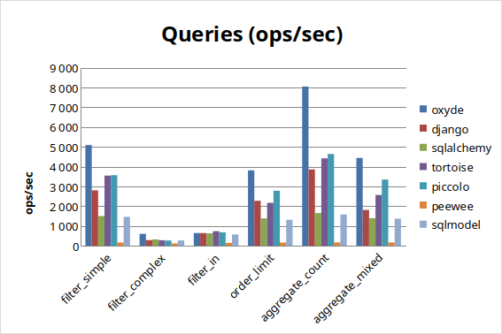
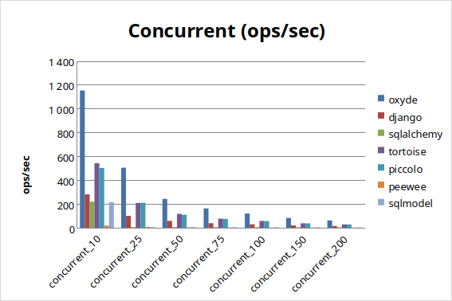
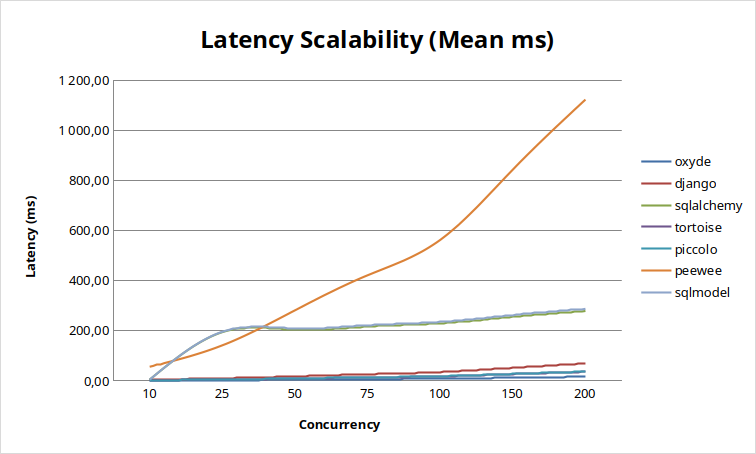
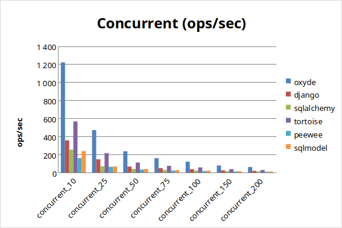
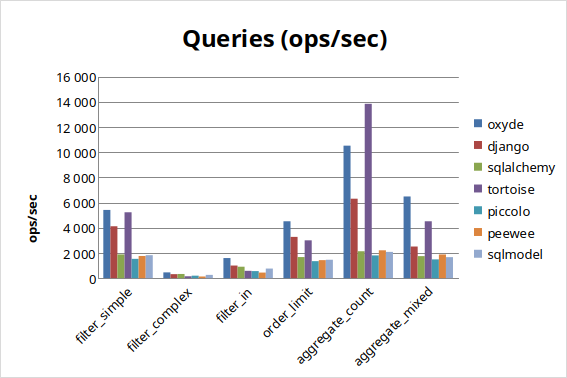
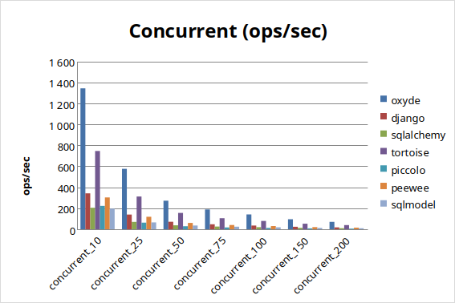

# Oxyde ORM Benchmark Report

**Date:** March 7, 2026
**Configuration:** 100 iterations, 10 warmup, 1000 users, 20 posts/user

## Summary (average ops/sec)

### PostgreSQL

| Rank | ORM | Relative Score | Avg ops/sec |
|------|-----|----------------|-------------|
| 1 | **Oxyde** | 0.920 | 1,433 |
| 2 | Piccolo | 0.614 | 956 |
| 3 | Tortoise | 0.575 | 896 |
| 4 | Django | 0.470 | 733 |
| 5 | SQLAlchemy | 0.292 | 455 |
| 6 | SQLModel | 0.278 | 433 |
| 7 | Peewee | 0.050 | 79 |

### MySQL

| Rank | ORM | Relative Score | Avg ops/sec |
|------|-----|----------------|-------------|
| 1 | **Oxyde** | 1.127 | 1,284 |
| 2 | Django | 0.717 | 816 |
| 3 | Tortoise | 0.687 | 783 |
| 4 | SQLAlchemy | 0.459 | 523 |
| 5 | SQLModel | 0.442 | 503 |
| 6 | Peewee | 0.410 | 467 |

*Piccolo does not support MySQL.*

### SQLite

| Rank | ORM | Relative Score | Avg ops/sec |
|------|-----|----------------|-------------|
| 1 | **Oxyde** | 0.381 | 2,575 |
| 2 | Tortoise | 0.279 | 1,884 |
| 3 | Django | 0.190 | 1,283 |
| 4 | SQLAlchemy | 0.088 | 592 |
| 5 | SQLModel | 0.083 | 560 |
| 6 | Peewee | 0.082 | 553 |
| 7 | Piccolo | 0.069 | 468 |

---

## PostgreSQL Results

### CRUD Operations

| Test | asyncpg | Oxyde | Django | SQLAlchemy | Tortoise | Piccolo | Peewee | SQLModel |
|------|---------|-------|--------|------------|----------|---------|--------|----------|
| insert_single | 761 | 655 | 640 | 536 | 750 | 714 | 142 | 536 |
| insert_bulk_100 | 416 | 361 | 251 | 187 | 257 | 204 | 99 | 128 |
| select_pk | 7,053 | 6,412 | 2,926 | 1,594 | 3,946 | 3,915 | 171 | 1,472 |
| select_filter | 813 | 308 | 154 | 168 | 144 | 133 | 94 | 142 |
| update_single | 745 | 768 | 622 | 523 | 693 | 746 | 143 | 523 |
| update_bulk | 649 | 652 | 600 | 501 | 647 | 665 | 140 | 499 |
| delete_single | 287 | 280 | 171 | 262 | 274 | 281 | 105 | 258 |

### Query Operations

| Test | asyncpg | Oxyde | Django | SQLAlchemy | Tortoise | Piccolo | Peewee | SQLModel |
|------|---------|-------|--------|------------|----------|---------|--------|----------|
| filter_simple | 5,698 | 5,088 | 2,801 | 1,502 | 3,544 | 3,564 | 166 | 1,461 |
| filter_complex | 1,383 | 601 | 287 | 324 | 281 | 268 | 121 | 271 |
| filter_in | 2,769 | 643 | 642 | 629 | 737 | 680 | 147 | 574 |
| order_limit | 4,593 | 3,808 | 2,274 | 1,381 | 2,170 | 2,780 | 166 | 1,312 |
| aggregate_count | 4,559 | 8,042 | 3,855 | 1,655 | 4,414 | 4,637 | 171 | 1,583 |
| aggregate_mixed | 5,146 | 4,437 | 1,811 | 1,396 | 2,564 | 3,344 | 169 | 1,369 |

### Relations

| Test | asyncpg | Oxyde | Django | SQLAlchemy | Tortoise | Piccolo | Peewee | SQLModel |
|------|---------|-------|--------|------------|----------|---------|--------|----------|
| join_simple | 22 | 10 | 3 | 5 | 4 | 2 | 4 | 4 |
| join_filter | 22 | 10 | 3 | 5 | 4 | 2 | 4 | 4 |
| prefetch_related | 33 | 4 | 4 | 4 | 6 | 5 | 5 | 3 |
| nested_prefetch | 25 | 2 | 1 | 2 | 4 | 3 | 4 | 2 |

### Concurrent Operations

| Concurrency | asyncpg | Oxyde | Django | SQLAlchemy | Tortoise | Piccolo | Peewee | SQLModel |
|-------------|---------|-------|--------|------------|----------|---------|--------|----------|
| 10 | 1,151 | 1,151 | 280 | 219 | 542 | 501 | 18 | 215 |
| 50 | 268 | 242 | 57 | 5 | 116 | 109 | 4 | 5 |
| 100 | 135 | 119 | 29 | 4 | 57 | 55 | 2 | 4 |

### Scalability

---

## MySQL Results

### CRUD Operations

| Test | aiomysql | Oxyde | Django | SQLAlchemy | Tortoise | Peewee | SQLModel |
|------|----------|-------|--------|------------|----------|--------|----------|
| insert_single | 769 | 648 | 647 | 568 | 682 | 561 | 531 |
| insert_bulk_100 | 384 | 312 | 232 | 156 | 243 | 196 | 115 |
| select_pk | 5,641 | 6,352 | 3,441 | 1,935 | 3,650 | 1,575 | 1,791 |
| select_filter | 139 | 359 | 180 | 91 | 80 | 93 | 81 |
| update_single | 728 | 685 | 660 | 570 | 669 | 574 | 527 |
| update_bulk | 2,174 | 2,048 | 1,745 | 1,149 | 1,834 | 1,289 | 1,204 |
| delete_single | 684 | 677 | 339 | 566 | 657 | 506 | 529 |

### Query Operations

| Test | aiomysql | Oxyde | Django | SQLAlchemy | Tortoise | Peewee | SQLModel |
|------|----------|-------|--------|------------|----------|--------|----------|
| filter_simple | 2,981 | 2,880 | 2,659 | 1,526 | 2,326 | 1,277 | 1,467 |
| filter_complex | 281 | 642 | 325 | 176 | 166 | 180 | 161 |
| filter_in | 717 | 1,390 | 744 | 517 | 443 | 426 | 478 |
| order_limit | 2,752 | 3,405 | 2,430 | 1,331 | 1,812 | 1,162 | 1,264 |
| aggregate_count | 4,647 | 5,369 | 3,650 | 2,017 | 3,336 | 1,630 | 1,965 |
| aggregate_mixed | 3,343 | 3,662 | 1,830 | 1,507 | 1,791 | 1,414 | 1,534 |

### Relations

| Test | aiomysql | Oxyde | Django | SQLAlchemy | Tortoise | Peewee | SQLModel |
|------|----------|-------|--------|------------|----------|--------|----------|
| join_simple | 4 | 11 | 4 | 3 | 3 | 2 | 2 |
| join_filter | 4 | 11 | 4 | 3 | 3 | 2 | 3 |
| prefetch_related | 6 | 12 | 5 | 3 | 3 | 4 | 3 |
| nested_prefetch | 6 | 8 | 1 | 2 | 2 | 3 | 2 |

### Concurrent Operations

| Concurrency | aiomysql | Oxyde | Django | SQLAlchemy | Tortoise | Peewee | SQLModel |
|-------------|----------|-------|--------|------------|----------|--------|----------|
| 10 | 1,083 | 1,220 | 356 | 253 | 566 | 159 | 238 |
| 50 | 209 | 235 | 66 | 40 | 110 | 32 | 39 |
| 100 | 105 | 119 | 37 | 22 | 56 | 16 | 21 |

### Scalability

---

## SQLite Results

> **Note:** Oxyde enables `journal_mode=WAL` and `synchronous=NORMAL` by default for SQLite connections. Other ORMs use SQLite defaults (`journal_mode=DELETE`, `synchronous=FULL`). This reflects real-world out-of-the-box performance.

### CRUD Operations

| Test | aiosqlite | Oxyde | Django | SQLAlchemy | Tortoise | Piccolo | Peewee | SQLModel |
|------|-----------|-------|--------|------------|----------|---------|--------|----------|
| insert_single | 775 | 5,054 | 698 | 568 | 725 | 159 | 158 | 569 |
| insert_bulk_100 | 622 | 754 | 290 | 75 | 332 | 100 | 120 | 61 |
| select_pk | 41,600 | 7,503 | 4,531 | 1,929 | 6,015 | 1,588 | 1,958 | 1,874 |
| select_filter | 1,078 | 284 | 196 | 188 | 82 | 115 | 73 | 156 |
| update_single | 785 | 8,561 | 707 | 573 | 720 | 161 | 165 | 560 |
| update_bulk | 13,388 | 7,719 | 6,040 | 1,622 | 8,370 | 1,730 | 2,262 | 1,634 |
| delete_single | 182 | 229 | 126 | 171 | 181 | 88 | 93 | 169 |

### Query Operations

| Test | aiosqlite | Oxyde | Django | SQLAlchemy | Tortoise | Piccolo | Peewee | SQLModel |
|------|-----------|-------|--------|------------|----------|---------|--------|----------|
| filter_simple | 18,518 | 5,413 | 4,118 | 1,882 | 5,228 | 1,529 | 1,762 | 1,822 |
| filter_complex | 1,778 | 460 | 315 | 330 | 147 | 196 | 131 | 259 |
| filter_in | 7,183 | 1,597 | 1,000 | 907 | 580 | 560 | 441 | 762 |
| order_limit | 12,346 | 4,513 | 3,275 | 1,673 | 3,002 | 1,348 | 1,428 | 1,458 |
| aggregate_count | 44,023 | 10,514 | 6,304 | 2,136 | 13,832 | 1,805 | 2,208 | 2,082 |
| aggregate_mixed | 12,986 | 6,482 | 2,508 | 1,749 | 4,512 | 1,489 | 1,880 | 1,667 |

### Relations

| Test | aiosqlite | Oxyde | Django | SQLAlchemy | Tortoise | Piccolo | Peewee | SQLModel |
|------|-----------|-------|--------|------------|----------|---------|--------|----------|
| join_simple | 28 | 7 | 4 | 5 | 3 | 2 | 2 | 4 |
| join_filter | 29 | 8 | 4 | 5 | 3 | 2 | 2 | 5 |
| prefetch_related | 44 | 9 | 5 | 4 | 4 | 4 | 3 | 3 |
| nested_prefetch | 35 | 8 | 1 | 2 | 3 | 3 | 2 | 2 |

### Concurrent Operations

| Concurrency | aiosqlite | Oxyde | Django | SQLAlchemy | Tortoise | Piccolo | Peewee | SQLModel |
|-------------|-----------|-------|--------|------------|----------|---------|--------|----------|
| 10 | 3,427 | 1,342 | 342 | 204 | 746 | 223 | 303 | 196 |
| 50 | 722 | 272 | 71 | 37 | 155 | 28 | 60 | 35 |
| 100 | 362 | 141 | 35 | 19 | 79 | 12 | 30 | 18 |

### Scalability

---

## Latency

### PostgreSQL - Mean Latency (ms)

| Test | asyncpg | Oxyde | Django | SQLAlchemy | Tortoise | Piccolo | Peewee | SQLModel |
|------|---------|-------|--------|------------|----------|---------|--------|----------|
| insert_single | 1.315 | 1.526 | 1.562 | 1.866 | 1.333 | 1.400 | 7.030 | 1.866 |
| select_pk | 0.142 | 0.156 | 0.342 | 0.627 | 0.253 | 0.256 | 5.848 | 0.679 |
| update_single | 1.342 | 1.302 | 1.609 | 1.911 | 1.443 | 1.341 | 7.015 | 1.913 |
| filter_simple | 0.175 | 0.197 | 0.357 | 0.666 | 0.282 | 0.281 | 6.030 | 0.684 |
| aggregate_count | 0.219 | 0.124 | 0.259 | 0.604 | 0.227 | 0.216 | 5.841 | 0.632 |

### PostgreSQL - P99 Latency (ms)

| Test | asyncpg | Oxyde | Django | SQLAlchemy | Tortoise | Piccolo | Peewee | SQLModel |
|------|---------|-------|--------|------------|----------|---------|--------|----------|
| insert_single | 1.506 | 6.481 | 1.759 | 2.002 | 1.584 | 1.720 | 7.435 | 2.241 |
| select_pk | 0.159 | 0.359 | 0.391 | 0.695 | 0.277 | 0.338 | 6.222 | 0.983 |
| update_single | 1.613 | 1.419 | 5.259 | 5.619 | 1.734 | 1.590 | 7.402 | 2.808 |
| filter_simple | 0.257 | 0.257 | 0.619 | 1.121 | 0.356 | 0.318 | 6.581 | 0.755 |
| aggregate_count | 0.246 | 0.166 | 0.366 | 0.667 | 0.251 | 0.320 | 6.391 | 0.856 |

---

## Memory Usage

### PostgreSQL - Peak Memory (MB)

| Test | asyncpg | Oxyde | Django | SQLAlchemy | Tortoise | Piccolo | Peewee | SQLModel |
|------|---------|-------|--------|------------|----------|---------|--------|----------|
| insert_single | 38.7 | 52.7 | 66.2 | 58.3 | 51.1 | 41.7 | 59.0 | 65.6 |
| select_pk | 44.6 | 57.6 | 71.4 | 64.0 | 56.4 | 47.5 | 63.2 | 71.3 |
| join_simple | 73.8 | 148.9 | 107.6 | 95.6 | 85.7 | 101.2 | 97.9 | 107.7 |
| nested_prefetch | 80.0 | 149.3 | 161.1 | 114.4 | 122.1 | 103.9 | 103.5 | 127.8 |
| concurrent_100 | 108.3 | 122.0 | 132.8 | 115.2 | 147.8 | 125.1 | 98.2 | 123.5 |

---

## Test Environment

| Parameter | Value |
|-----------|-------|
| CPU | Intel Core i7-11800H @ 2.30GHz |
| Cores | 2 |
| RAM | 4 GB |
| OS | Linux 6.17.0-14-generic |
| Python | 3.12.13 |
| Container | Docker |

### Package Versions

| Package | Version |
|---------|---------|
| oxyde | 0.5.0 |
| asyncpg | 0.31.0 |
| django | 6.0.3 |
| sqlalchemy | 2.0.48 |
| tortoise-orm | 1.1.6 |
| piccolo | 1.33.0 |
| peewee | 4.0.1 |
| sqlmodel | 0.0.37 |

### Test Data

- Users: 1,000
- Posts per user: 20
- Total posts: 20,000
